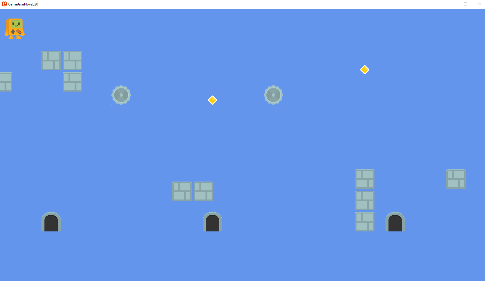

# Game Jam Nov 2020

Jeff and I (Maria) made an arcade game to explore ECS (entity component system) in C# using the Monogame.Extended ECS library. 

The goal of the game is to consume the yellow crystals to duplicate yourself and then use the walls to position each clone on a door. There are 2 levels.

## Running the game

You can open GameJamNov2020.sln, pull nuget packages and run. (Requries Visual Studio 2019)

OR

Download the "Running the game" folder and run GameJamNov2020.exe.

## Libraries used

[Monogame.Extended](https://github.com/craftworkgames/MonoGame.Extended)

## Assets

We got all the art from [Kenny Assets](https://www.kenney.nl/assets/simplified-platformer-pack). Thank you!

## Impressions about ECS

The [Overwatch talk](https://www.youtube.com/watch?v=W3aieHjyNvw&feature=youtu.be&ab_channel=GDC) got us both excited about ECS since it promisses simplicity in complex games and also because data oriented development sounds like every developer's dream. So we wanted to give it a try for ourselves. We chose C# since we are more comfortbale in this language and Monogame.Extended was the best C# ECS library out there.

* It took us less than 24h to make the current game. Adding functionality is very easy and decoupled. Jeff and I each picked a feature and we could work on it without stepping on each other's toes or waiting for the other to finish. Merge conflicts were only in Simulation.cs and they involved keeping both changes.

* We aimed for pure ECS in this prototype and managed to mostly achieve it. The only exceptions are that we used Transform2 and Sprite from Monogame.Extended as components which spoils the ECS purity since these classes contain methods in them when they should only contain fields. But it worked well. Also, to end the game once the win condition is achieved, we reached outside the simulation which systems aren't supposed to do.

* There is an acute lack of documentation with ECS design patterns and anti patterns. We ran a search on safari books and there are about 6 books which have a few paragraphs about ECS in general. There are no ECS dedicated books, yet. There are talks and blog posts about ECS, but no advice or signaled pitfalls.

We ran into 2 issues with the Monogame.Extended library.

* It only allows 32 components which was enough for our experiment but not enough for a more complex game.

* If you have a system that looks for a component that hasn't been set on any entity in the simulation yet, world.Update will throw a null ref exception. This is an issue in the library because instead of returning a null, it should return an empty collection. So in our case we had the component called NeedsToDuplicate which we give to the player entity after it collides with the duplicate power up (yellow crystal) so that in the next frame, the DuplicationSystem can pick it up and create a clone. So this compononet isn't added to the entity until the player takes a duplicate power up. The workaround for this is to make an empty entity in Simulation.cs, add the NeedsToDuplicate component to it, and then immiediately destroy the entity so nothing renders. This causes the library to return an empty collection instead of null.

Overall we really enjoyed ECS and if we can find a more mature library, we're probabaly going to be building all of our future games in ECS. 
